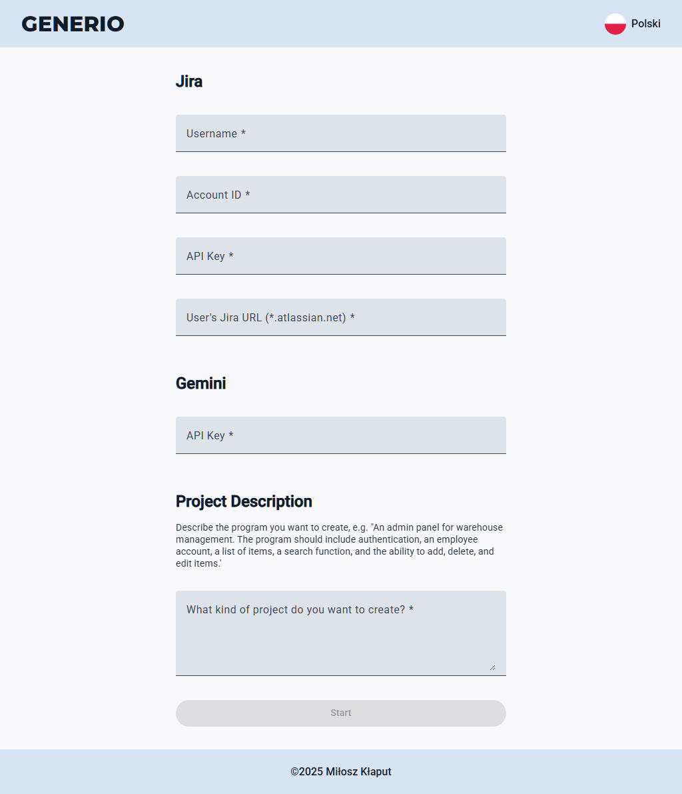

# Generio

**Generio** is an open-source application designed to automate the creation of software projects in Jira Cloud.  
It combines the power of REST APIs with generative AI to build complete, realistic project structures — including epics, tasks, sprints, and backlogs — based on simple user inputs.

---

## Key Features

- Automatic creation of complete Scrum-based projects in Jira.
- Integration with **Google Gemini** LLM to generate realistic, business-like task descriptions.
- Support for multi-language UI (**English** and **Polish**).
- Responsive Web Design (RWD) — optimized for smartphones, tablets, and desktops.

---

## Preview

Here is a preview of the Generio application:



---

## Technologies Used

- **Frontend:** Angular + Angular Material
- **Backend:** Node.js + Express.js
- **External services:** 
  - Google Gemini API (for prompt processing)
  - Atlassian Jira REST API and Jira Agile REST API

---

## Installation

Follow these steps to run **Generio** locally:

1. **Clone the repository:**
   ```bash
   git clone https://github.com/MiloszKlaput/generio.git
   cd generio
   ```

2. **Install dependencies for both frontend and backend:**
   ```bash
   npm run install:all
   ```

   This command automatically:
   - Installs backend dependencies in `be/`
   - Installs frontend dependencies in `fe/`

3. **Run the application:**
   ```bash
   npm run start:all
   ```

   This command will:
   - Start the backend server (`be/`) using Node.js and Express.js
   - Start the frontend application (`fe/`) using Angular
   - Automatically open the application in your default browser at `http://localhost:4200/`

4. **Requirements:**
   - Node.js version 18+ recommended
   - npm version 9+ recommended

---

## Requirements to Use

Before using Generio, make sure you have:

- A **Jira** account and a valid **Jira API key**.
- A **Google** account and a valid **Google Gemini API key**.

Once your accounts and API keys are ready, simply describe your project idea in the provided form — Generio will automatically generate all necessary project elements in Jira, including:

- Sprints
- Epics
- Tasks
- Assignment of tasks to epics and sprints

Generio streamlines the entire setup process, allowing you to focus on project development instead of manual configuration.

---

## Directory Structure

```
generio/
├── be/          # Backend (Node.js + Express.js server)
├── fe/          # Frontend (Angular application)
├── package.json # Main package.json for managing both frontend and backend
└── README.md
```

---

## License

This project is licensed under the [MIT License](LICENSE).
